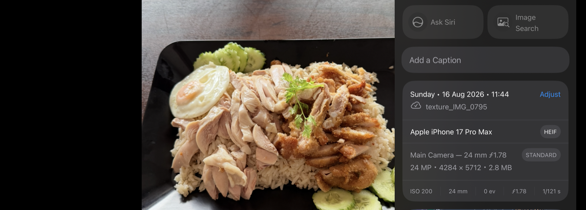
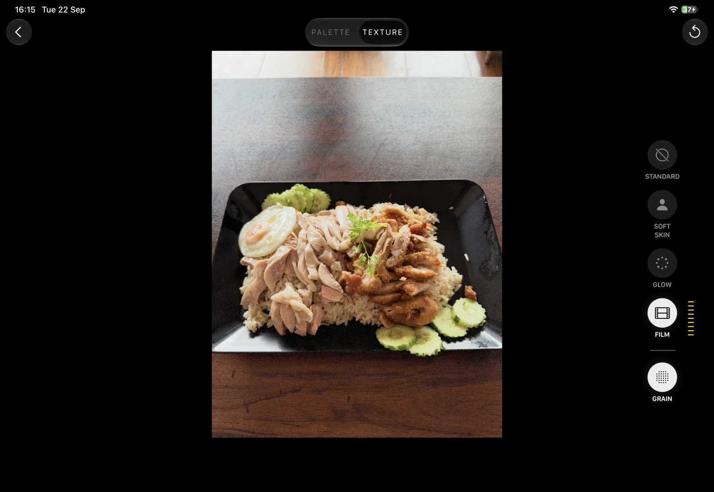

# Texture Styles Injector

ทำให้ปุ่ม **Texture** ของ iPhone 18 โผล่ในแอพรูป บนรูปที่ถ่ายด้วย iPhone รุ่นเก่า

[English below](#english)

---

## เรื่องย่อ

iPhone 18 มีปุ่มปรับ **Texture** (Photographic Styles 3) เครื่องรุ่นเก่าไม่มี
คำถามคือ — มันล็อกที่ตัวเครื่อง หรือล็อกที่ตัวไฟล์รูป

**คำตอบ: ล็อกที่ไฟล์รูป** ถ้าใส่ของที่ขาดเข้าไปในรูป ปุ่มก็โผล่บนเครื่องเก่าได้
ทดสอบแล้วบน iPhone 17 Pro Max + iOS 27

## ของที่ขาดคืออะไร

รูปหนึ่งใบไม่ได้มีแค่ภาพ แต่มี "ซองเอกสาร" แนบมาด้วย

ตอน iPhone 18 ถ่ายรูป มันแอบวาด **แผนที่อวัยวะ** แนบไว้ 12 แผ่น —
แผ่นหนึ่งบอกว่า "ตรงนี้คือคน" อีกแผ่นบอก "ตรงนี้คือใบหน้า" แล้วก็มี
จมูก ปาก ฟัน คิ้ว มือ หู

แอพรูปต้องการแผนที่พวกนี้ เพราะปุ่ม Texture คือการปรับผิว
มันต้องรู้ก่อนว่าผิวอยู่ตรงไหน ไม่งั้นปรับมั่วทั้งรูป

iPhone 17 วาดแผนที่ไม่เป็น รูปจาก 17 เลยไม่มี 12 แผ่นนี้ → ปุ่มไม่ขึ้น

## กุญแจ 3 ดอก

| # | สิ่งที่ต้องมี | ทางเทคนิค |
|---|---|---|
| 1 | แผนที่อวัยวะ 12 แผ่น | `tag:apple.com,2026:photo:aux:*` |
| 2 | ใบแจ้งว่า "รูปนี้มีแผนที่" | `tag:apple.com,2026:photo:metadata:texture_styles` |
| 3 | แผนที่ต้องสัดส่วนเท่ารูป | matte `ispe` ratio == primary ratio |

ขาดข้อไหนก็ไม่ขึ้น

**สิ่งที่ไม่ต้องทำเลย** — ปลอมชื่อรุ่นเป็น "iPhone 18" ในไฟล์
ทดสอบแล้วไม่ช่วยอะไร แอพไม่ได้ดูตรงนั้น

<a name="english"></a>
---

## เครื่องมือนี้ทำอะไร

แทนที่จะยืมแผนที่จากรูป iPhone 18 (ซึ่งจะได้แผนที่ของคนในรูปอื่น วางผิดตำแหน่ง)
เครื่องมือนี้ **วาดแผนที่จากรูปของคุณเอง** ด้วยระบบตรวจจับคนที่ฝังอยู่ใน macOS
แล้วยัดกลับเข้าไปในรูป

- ภาพต้นฉบับ **ไม่ถูกแตะต้อง** คัดลอกไบต์ต่อไบต์ ไม่มีการบีบอัดซ้ำ
- ไฟล์ **ไม่ถูกส่งออกนอกเครื่อง** ทำงานบนคอมคุณทั้งหมด

---

## ผลจริง

รูปถ่ายด้วย **iPhone 17 Pro Max** ผ่านเครื่องมือนี้ แล้วเปิดใน Photos:



ไฟล์ `texture_IMG_0795` ยังเป็น HEIF จาก iPhone 17 Pro Max ขนาดเดิม 4284 × 5712



แท็บ **TEXTURE** ขึ้นครบ — Soft Skin / Glow / Film / Grain

---

## ✅ ยืนยันแล้วว่าใช้ได้

ทดสอบบน **iPhone 17 Pro Max + iOS 27** เมื่อ 22 ก.ย. 2026 — ไฟล์ที่ผ่าน
เครื่องมือนี้ (ซึ่งวาด matte เองจากรูป ไม่ได้ยืมจากรูป iPhone 18)
แสดงแท็บ TEXTURE ครบ: SOFT SKIN / GLOW / FILM / GRAIN

**หมายเหตุเรื่องรูปที่ไม่มีคน** — FILM กับ GRAIN ทำงานทั้งภาพ จึงเห็นผลได้เลย
ส่วน SOFT SKIN ต้องมีคนในเฟรมถึงจะมีผล เพราะมันปรับเฉพาะผิว

---

## ต้องมีอะไร

### คอมพิวเตอร์ — ต้องเป็น Mac เท่านั้น

| | |
|---|---|
| macOS 12 ขึ้นไป | ระบบตรวจจับคนต้องการเวอร์ชันนี้ |
| Python 3 | มีติดมากับ Mac แล้ว |
| Xcode Command Line Tools | `xcode-select --install` |
| ffmpeg | `brew install ffmpeg` |

**ทำไมต้อง Mac** — ใช้ระบบตรวจจับคน/ใบหน้าที่ฝังอยู่ใน macOS
(ตัวเดียวกับที่แอพรูปใช้ค้นหา "รูปที่มีหมา") Windows กับ Linux ไม่มี
และเอาขึ้นเว็บโฮสต์ไม่ได้ด้วย

### มือถือ

ทดสอบแล้วบน **iPhone 17 Pro Max + iOS 27** — ไม่ต้องมี iPhone 18

### รูปที่จะใช้

| | แบบไหน |
|---|---|
| ✅ **ดีที่สุด** | HEIC ถ่ายสดจาก iPhone ยังไม่เคยแก้ไข **และมีคนในรูป เห็นหน้าชัด** |
| 🟡 ใช้ได้ | HEIC ที่ผ่าน export มาแล้ว (โปรแกรมจะเตือน) |
| ❌ ใช้ไม่ได้ | JPEG, PNG, รูปที่ส่งผ่าน LINE/Messenger, รูปจาก iPhone 18 |

**สำคัญ** — ต้องเอารูปเข้า Mac ด้วย **AirDrop หรือสาย USB** เท่านั้น
ส่งผ่านแชทจะโดนบีบอัดจนของข้างในหายหมด

---


## ใช้กับ AI agent

มี skill แยก repo ให้ agent จัดการให้ได้เลย:

**https://github.com/stamp44101/texture-styles-skill**

```bash
git clone https://github.com/stamp44101/texture-styles-skill.git \
  ~/.claude/skills/texture-styles
cd ~/.claude/skills/texture-styles
swiftc -O tools/gen/genmattes.swift -o tools/gen/genmattes
```

แล้วบอก agent ว่า *"ใส่ Texture ให้รูปนี้หน่อย"* หรือ *"ทำทั้งโฟลเดอร์"*

---

## วิธีใช้ (เว็บแอพ)

**1. ติดตั้ง (ครั้งเดียว)**

```bash
xcode-select --install
brew install ffmpeg
```

**2. เตรียมเครื่องมือ (ครั้งเดียว)**

```bash
git clone https://github.com/stamp44101/texture-styles-injector.git
cd texture-styles-injector
swiftc -O tools/gen/genmattes.swift -o tools/gen/genmattes
```

**3. เปิดโปรแกรม**

```bash
python3 server.py
```

เปิดเบราว์เซอร์ไปที่ `http://127.0.0.1:8765`

**4. ลากรูปใส่** → รอไม่กี่วินาที → **กดดาวน์โหลด**

**5. AirDrop กลับเข้า iPhone** (ห้ามส่งผ่านแชท)

**6. เปิดรูป → Edit → Photographic Styles** ดูว่ามีสไลเดอร์ Texture ไหม

**7. ปิดโปรแกรม** — กลับไป Terminal กด `Control + C`

---

## ถ้าไม่สำเร็จ

| อาการ | สาเหตุ |
|---|---|
| "ไม่ใช่ไฟล์ HEIF" | เป็น JPEG หรือโดนบีบอัดมา — หารูปต้นฉบับใหม่ |
| "มี texture อยู่แล้ว" | รูปนี้ถ่ายจาก iPhone 18 อยู่แล้ว |
| ทำสำเร็จแต่ปุ่มไม่ขึ้น | ส่งไฟล์ผิดวิธี ลอง AirDrop ใหม่ |
| `command not found: brew` | ยังไม่ได้ติดตั้ง [Homebrew](https://brew.sh) |
| `command not found: swiftc` | ยังไม่ได้ `xcode-select --install` |

---

## ข้อจำกัด

- ระบบของ Mac วาดได้แค่ คน / ใบหน้า / ปาก / จมูก / คิ้ว
  ส่วน **แว่น / รอยสัก / หู / มือ** วาดไม่ได้ เป็นค่าว่าง
- ยังแยกผิวออกจากเสื้อผ้าไม่ได้ ใช้เงาคนทั้งตัวแทน
- **รูปที่ไม่มีคนจะแทบไม่มีผล** — รูปวิว รูปอาหาร ไม่เหมาะ

---

## เรามาถึงจุดนี้ได้ยังไง

ลองผิดลองถูก 5 รอบ:

| รอบ | ลองอะไร | ผล |
|---|---|---|
| 1 | ใส่แค่ "ใบแจ้ง" อย่างเดียว | **พังหนักกว่าเดิม** ปุ่มปรับสีที่เคยมีหายไปเลย |
| 2 | ยัดค่าสีของ iPhone 18 เข้าไป | ปรับได้ แต่แบบเก่า → ค่าสีไม่เกี่ยว |
| 3 | ปลอมชื่อรุ่นเป็น iPhone 18 | ปรับได้ แต่แบบเก่า → ชื่อรุ่นไม่เกี่ยว |
| 4 | ย้ายแผนที่ 12 แผ่นมาด้วย | ✅ **ปุ่มโผล่** |
| 5 | ลองกับรูปอื่น | ไม่ขึ้น → เจอว่าสัดส่วนต้องตรงกัน |

รอบ 1 น่าสนใจ — เหมือนแปะป้ายหน้าร้าน "มีของขาย" แต่ในร้านว่างเปล่า
ลูกค้าเข้ามาเห็นแล้วเดินออกไปเลย แอพก็เหมือนกัน เจอใบแจ้งแต่หาแผนที่ไม่เจอ
มันเลยเลิกเชื่อรูปนั้นทั้งใบ

รายละเอียดทางเทคนิคเต็ม ๆ อยู่ใน [docs/FINDINGS.md](docs/FINDINGS.md)

---

## ความเป็นส่วนตัว

- ไฟล์ทั้งหมดประมวลผลบนเครื่องคุณ **ไม่มีการอัปโหลดขึ้นอินเทอร์เน็ต**
- เซิร์ฟเวอร์ผูกกับ `127.0.0.1` เท่านั้น เครื่องอื่นในเน็ตเวิร์กเข้าไม่ถึง
- ไฟล์ถูกลบทิ้งทันทีหลังดาวน์โหลด
- repo นี้ **ไม่มีรูปตัวอย่าง** เพราะรูปจาก iPhone มีพิกัด GPS ฝังอยู่

---

## License

MIT

---

# English

Make the **Texture** slider (iPhone 18's Photographic Styles 3) appear in Photos
for pictures taken on older iPhones.

**The gate is the file, not the device.** Tested working on iPhone 17 Pro Max / iOS 27.

An iPhone 18 photo carries 12 semantic mattes (`tag:apple.com,2026:photo:aux:*`)
— masks telling Photos where the person, face, nose, lips, teeth, eyebrows,
hands and ears are. Texture adjusts skin, so Photos needs those masks. Older
iPhones don't write them, so the slider never appears.

**Three things are required:**
1. The 12 aux mattes
2. The `texture_styles` metadata item that declares them
3. Matte aspect ratio matching the primary image

Faking the EXIF model string to "iPhone 18 Pro Max" does nothing — tested.

This tool generates mattes **from your own photo** using macOS Vision, so the
masks actually line up, then injects them without re-encoding a single pixel.

> ✅ **Confirmed working.** Verified on iPhone 17 Pro Max / iOS 27 with mattes
> generated locally from the user's own photo — the full TEXTURE tab appears
> (Soft Skin / Glow / Film / Grain). Film and Grain apply to the whole frame, so
> they work on any photo; Soft Skin needs a person in the shot.

**Requires macOS 12+, ffmpeg, Xcode CLT.** Mac only — it uses Apple's Vision
framework, which can't be hosted on a server.

```bash
xcode-select --install && brew install ffmpeg
swiftc -O tools/gen/genmattes.swift -o tools/gen/genmattes
python3 server.py     # → http://127.0.0.1:8765
```

Drop in a HEIC straight from an iPhone **with a visible face**, download the
result, and AirDrop it back. Nothing leaves your machine.
